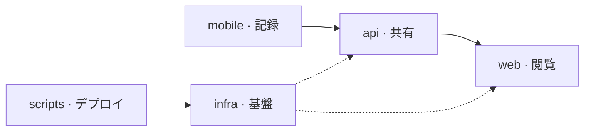

# Beatavue

[English](README.md) · [技術](tech-jp.md) · [セットアップ](setup-jp.md) · [Web](https://beatavue.web.app)

心拍の履歴。iPhone、Watch、Web。

[モバイル](mobile/ios/Beatavue/README-jp.md) · [API](api/README-jp.md) · [Web](web/README-jp.md) · [基盤](infra/README-jp.md) · [スクリプト](scripts/)
