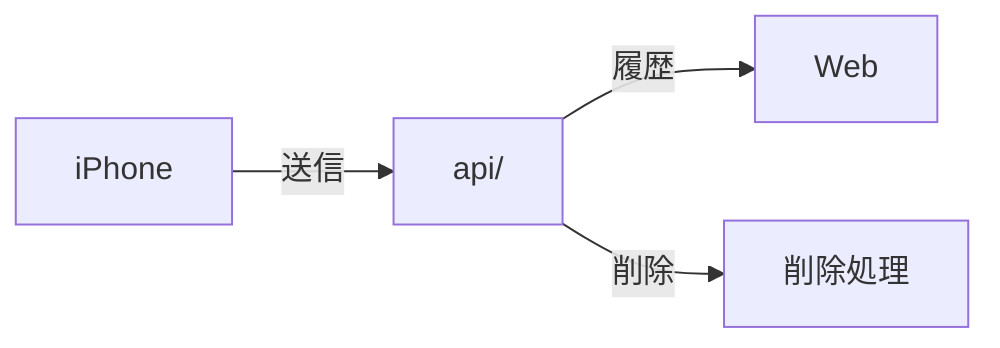

# api/

[English](README.md) · [技術](../tech-jp.md) · [セットアップ](../setup-jp.md)

健康データの送信・取得・削除。

```mermaid
flowchart LR
    Phone[iPhone] -->|送信| API[api/]
    API -->|履歴| Web[Web]
    API -->|削除| Cleanup[削除処理]
```

[検証](tests/)
