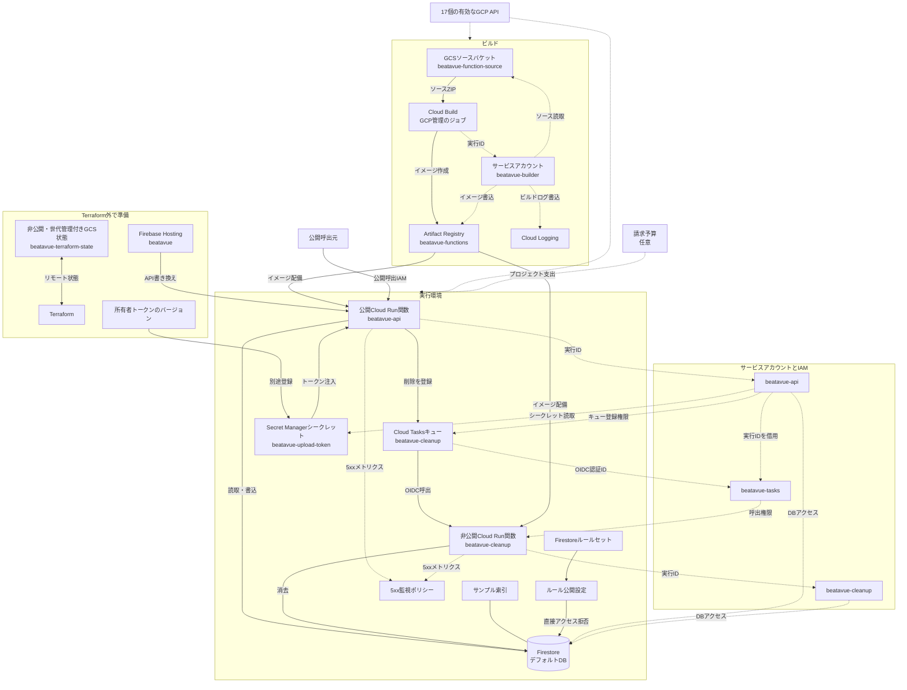

# infra/

[English](README.md) · [技術](../tech-jp.md) · [セットアップ](../setup-jp.md)

`beatavue` · `256425564793` · 東京

名前付きの資源とIAM権限をTerraformで作成。Cloud BuildジョブとCloud LoggingはGCP管理の
サービス。状態、Hosting、トークン値は別途準備する。予算は任意。
