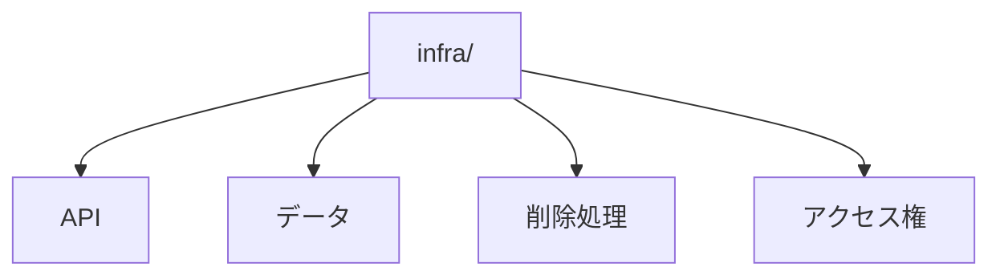

# infra/

[English](README.md) · [技術](../tech-jp.md) · [セットアップ](../setup-jp.md)

クラウド基盤。`beatavue` · 東京。

```mermaid
flowchart TD
    Infra[infra/] --> API[API]
    Infra --> Data[データ]
    Infra --> Cleanup[削除処理]
    Infra --> Access[アクセス権]
```
