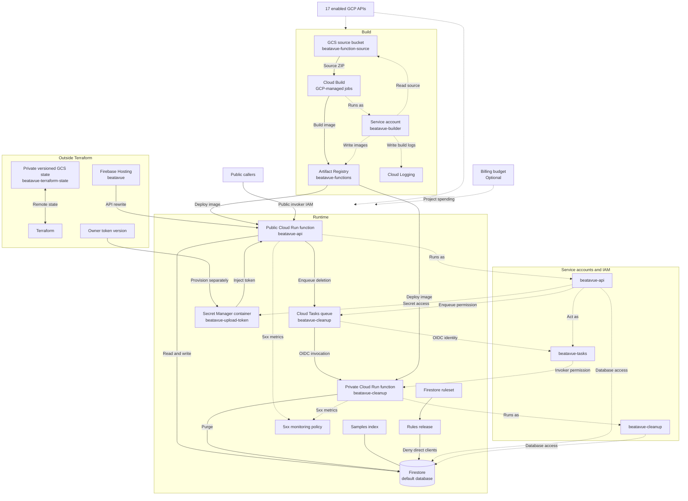

# infra/

[日本語](README-jp.md) · [Tech](../tech.md) · [Setup](../setup.md)

`beatavue` · `256425564793` · Tokyo

Terraform creates the named resources and IAM bindings. Cloud Build jobs and Cloud Logging are
GCP-managed services. State, Hosting, and token values are bootstrapped separately. Budget is optional.
