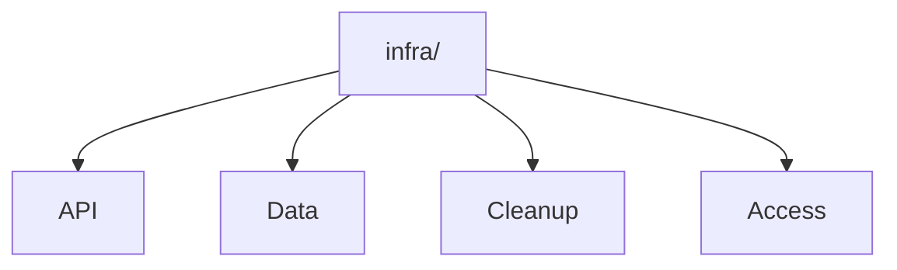

# infra/

[日本語](README-jp.md) · [Tech](../tech.md) · [Setup](../setup.md)

Cloud home. `beatavue` · Tokyo.

```mermaid
flowchart TD
    Infra[infra/] --> API[API]
    Infra --> Data[Data]
    Infra --> Cleanup[Cleanup]
    Infra --> Access[Access]
```
