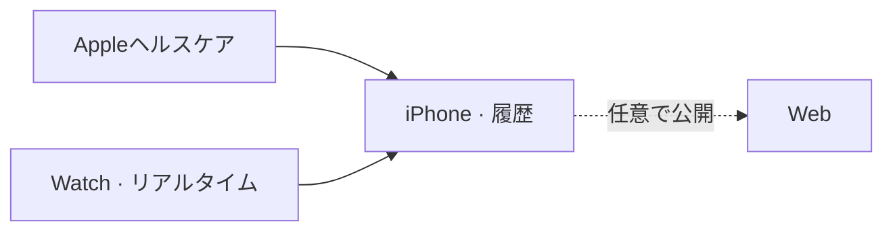

# mobile/ios/Beatavue/

[English](README.md) · [技術](../../../tech-jp.md) · [セットアップ](../../../setup-jp.md)

iPhoneで履歴。Watchでリアルタイム心拍。

[iPhone](Beatavue/) · [Watch](<Beatavue Watch Watch App/>) · [Xcode](Beatavue.xcodeproj/)
