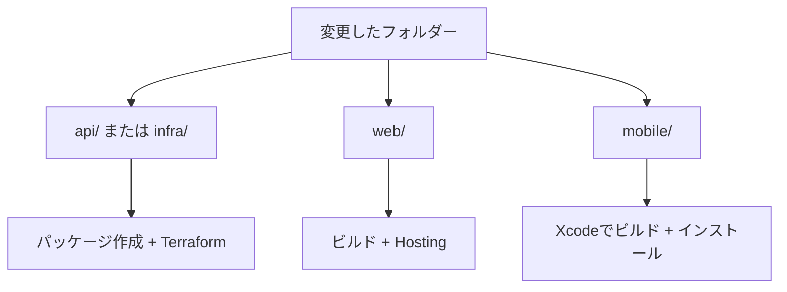

# セットアップとデプロイ

[English](setup.md) · [フォルダー](README-jp.md) · [技術](tech-jp.md)

特記がなければ、リポジトリのルートで実行する。
既存プロジェクト: **beatavue / 256425564793**、東京。デプロイ済み。


## 1. ツールと認証

| ツール | 要件 |
| --- | --- |
| Xcode | iOS・watchOS SDK。実機にはHealthKit対応の署名チーム |
| Python | 3.12以上 |
| Node.js | 22.12以上 |
| Terraform | 1.6以上 |
| Google Cloud CLI | `gcloud` |
| Firebase CLI | 15.33.0 |
| Java | 21以上。Firestoreエミュレーターのみ |

Google Cloud CLIとTerraformは公式インストーラーで導入。依存関係を準備する。

```sh
python3 -m venv .venv
.venv/bin/python -m pip install -r api/requirements-dev.txt
npm --prefix web ci
npm install --prefix /tmp/beatavue-cli firebase-tools@15.33.0
export PATH="/tmp/beatavue-cli/node_modules/.bin:$PATH"
```

ローカルではログインし、CIではWorkload Identity Federationを使う。

```sh
gcloud auth login
gcloud auth application-default login
gcloud config set project beatavue
gcloud auth application-default set-quota-project beatavue
firebase login --reauth
gcloud projects describe beatavue --format='value(projectNumber)'
gcloud billing projects describe beatavue
```

番号`256425564793`と有効な請求設定を確認。実行者には基盤の管理とサービスアカウントとして
実行する権限が必要。短期間の認証情報を使い、サービスアカウント鍵は作らない。

## 2. 既存デプロイに接続

```sh
terraform -chdir=infra init -reconfigure -backend-config=backend.hcl.example
```

新しいチェックアウトでは、**planの前に**リモート状態から非機密の関数設定を復元する。

```sh
python3 - <<'PYTHON'
import json, re, subprocess
from pathlib import Path
state = json.loads(subprocess.check_output(
    ["terraform", "-chdir=infra", "show", "-json"], text=True))
api = next(r["values"] for r in state["values"]["root_module"]["resources"]
           if r["address"] == "google_cloudfunctions2_function.api[0]")
values = {
    "deploy_functions": True,
    "source_object": api["build_config"][0]["source"][0]["storage_source"][0]["object"],
    "upload_token_version": api["service_config"][0]["secret_environment_variables"][0]["version"],
    "region": api["location"],
}
path = Path("infra/terraform.tfvars")
existing = path.read_text() if path.exists() else ""
pattern = r"(?m)^\s*(?:deploy_functions|source_object|upload_token_version|region)\s*=.*(?:\n|$)"
kept = re.sub(pattern, "", existing)
path.write_text(kept + "\n" + "".join(
    f"{key} = {json.dumps(value)}\n" for key, value in values.items()))
print("Saved infra/terraform.tfvars")
PYTHON
```

トークンを含まない設定を、Git対象外のファイルに保存する。別途設定した予算項目は保持する。
復元しないと、既定の`deploy_functions=false`により関数の削除が計画される。
状態にAPIがなければ、以下の未構築スタック向け手順を使う。

```sh
terraform -chdir=infra plan
```

未変更のチェックアウトでは差分なしになる。予期しない変更はapply前に確認する。
`terraform.tfvars`、状態、plan、認証情報、トークンはコミットしない。

## 3. 未構築のスタックだけを初期構築

**現在のデプロイでは、この節を省略する。** 同じプロジェクトに未構築のスタックを用意する
場合だけ実行。既存のデータベース、バケット、シークレット、サービスアカウント、キュー、
索引、Firestoreルールを調べ、一致する資源をimportし、他のアプリのルールを保持する。

```sh
gcloud services enable cloudresourcemanager.googleapis.com cloudbilling.googleapis.com --project beatavue
gcloud firestore databases list --project beatavue
gcloud functions list --gen2 --project beatavue
gcloud storage buckets list --project beatavue
```

状態バケットがなければ作成する。

```sh
gcloud storage buckets create gs://beatavue-terraform-state \
  --project=beatavue --location=asia-northeast1 --uniform-bucket-level-access
gcloud storage buckets update gs://beatavue-terraform-state \
  --versioning --public-access-prevention
```

IAMはデプロイ実行者とCIに限定。Firebaseの追加・サイト作成も、未作成の場合だけ行う。

```sh
firebase projects:addfirebase beatavue
firebase hosting:sites:list --project beatavue
# 既定サイトがない場合だけ:
firebase hosting:sites:create beatavue --project beatavue
```

```sh
terraform -chdir=infra init -reconfigure -backend-config=backend.hcl.example
# 既存のデフォルトDBを取り込む場合だけ:
terraform -chdir=infra import 'google_firestore_database.default[0]' \
  'projects/beatavue/databases/(default)'
terraform -chdir=infra plan -var='deploy_functions=false' -out=bootstrap.tfplan
terraform -chdir=infra apply bootstrap.tfplan
```

既存DBの変更不可な場所を保持し、plan前に`region`を調整する。最初のapplyで基盤と空の
シークレット容器を作成。索引の構築には数分かかることがある。

パスワードマネージャーで十分にランダムなトークンを作成し、所有者用の控えを保持。
Secret Managerの画面か標準入力で登録する。値をコマンド引数やTerraform変数に渡さない。

```sh
gcloud secrets versions add beatavue-upload-token --project beatavue --data-file=-
```

標準入力にトークンを貼り付け、Control-Dで終了。数値のバージョンを記録し、節5でAPIとWebを
デプロイする。Firebaseアプリの登録やAuthenticationの設定は不要。

## 4. iPhone・Watchの初回設定

1. `mobile/ios/Beatavue/Beatavue.xcodeproj`を開き、iPhone・Watchの署名チームを選ぶ。
2. 実機iPhoneとペアリング済みWatchでビルド・実行し、必要なヘルスケア権限を許可する。
3. iPhoneのクラウド設定で、ベースURLを`https://beatavue.web.app`にする。
4. Macの**キーチェーンアクセス → ログイン**で、**Beatavue upload token**、アカウント**owner**を検索。
   認証してパスワードを表示・コピーする。別のMacでは、パスワードマネージャーか
   Secret Managerの画面から所有者のトークンを安全に取得する。
5. アプリのSecureFieldに入力して保存し、**公開を有効にする**で公開を確認する。
6. **今すぐ同期**を押し、Webと測定値が一致することを確認。リアルタイム心拍はWatchの
   ワークアウトを明示的に開始する。バックグラウンド同期は実機での検証が必要。

公開したデータは誰でも閲覧できる。一時停止してもクラウド履歴は残る。クラウド履歴の削除は
非表示化と消去を行う。同じ削除を完了まで確認する。時刻修正のためのリセットは不要。
更新したアプリは起動時に該当キューを自動復旧する。

## 5. 変更のデプロイ



### API・基盤

節2で復元した設定を使用。存在する数値のシークレットバージョンを指定する。

```sh
UPLOAD_TOKEN_VERSION=1 sh scripts/deploy-api.sh
```

スクリプトがソースをパッケージ化し、内容が変わらないZIPをアップロード、保存したTerraformの
planを表示してapplyする。成功後は**節2の復元ブロックを再実行**し、新しいソース名・
バージョンを保存する。予算を設定している場合はその項目も保持する。

ソースを変更せず、基盤だけを更新する場合:

```sh
terraform -chdir=infra fmt -check
terraform -chdir=infra validate
terraform -chdir=infra plan -out=changes.tfplan
terraform -chdir=infra apply changes.tfplan
```

### Web

```sh
sh scripts/deploy-web.sh
```

Firebase CLIが401を返したら、`firebase login --reauth`して再実行。サービス名・リージョンを
変更する場合はAPIを先にデプロイし、`firebase.json`のHosting書き換えも更新する。
`firebase.json`でサイト`beatavue`を明示している。この設定を維持し、CLIの
「no site name or target name」エラーを防ぐ。

### iPhone・Watch

```sh
cd mobile/ios/Beatavue
make lint
```

Xcode MCPの`BuildProject`でビルドし、Xcodeで実行・インストール。指示がない限りSwiftの
テストスイートは実行しない。iOSだけの変更ではAPIの再デプロイは不要。

### GitHub Actions

GitHub環境**gcp**を設定する。

| 変数 | 値 |
| --- | --- |
| `GCP_WORKLOAD_IDENTITY_PROVIDER` | リポジトリ・環境を限定したWIFプロバイダー |
| `GCP_DEPLOY_SERVICE_ACCOUNT` | 基盤デプロイ用サービスアカウント |
| `GCP_BILLING_ACCOUNT` | 任意。既存の予算設定と一致させる |

指定したGitHub IDに借用権限を与え、デプロイ用アカウントには状態・ソースへのアクセス、
資源・IAM管理、サービスアカウントとしての実行権限を与える。WIFの初期構築はこのTerraform
スタックの外で行う。**Deploy Scope 2**を手動実行し、`all`・`api`・`web`と既存の数値の
トークンバージョンを選ぶ。push・PRの検証は別に実行され、デプロイはしない。

## 6. ローカル開発と検証

別々のターミナルで実行する。

```sh
firebase emulators:start --only firestore --project demo-beatavue
```

```sh
cd api
FIRESTORE_EMULATOR_HOST=127.0.0.1:8081 GOOGLE_CLOUD_PROJECT=demo-beatavue \
  ../.venv/bin/functions-framework --target api --port 8080
```

```sh
cd web
npm run dev
```

ダッシュボードは`/v1`をポート8080に転送する。非公開APIを試す場合のみ、ローカル専用の
`UPLOAD_TOKEN`を環境変数で渡す。架空データとエミュレーター用プロジェクトを使う。

バックエンド検証。結合検証にはエミュレーターを起動しておく。

```sh
FIRESTORE_EMULATOR_HOST=127.0.0.1:8081 .venv/bin/python -m pytest -c api/pytest.ini api/tests -q
npm --prefix web run build
terraform -chdir=infra fmt -check
terraform -chdir=infra validate
```

デプロイ後:

```sh
curl --fail https://beatavue.web.app/v1/sync-status
terraform -chdir=infra plan -detailed-exitcode
```

HTTP 200、差分なしならTerraform終了コード0を確認。不正トークンによる変更を拒否すること、
架空データの取込・再試行・取得・削除を確認してから実データを公開する。実機ではオフライン・
再起動後の復旧、ロック中の転送、削除、Watchのミラーリングを確認する。

## 7. トークン更新と通知

Terraform外でSecret Managerに新しいバージョンを登録。その数値でAPIをデプロイし、
同じ接続先のiPhoneトークンを更新する。キューとアンカーは維持される。
旧バージョンを参照するAPIリビジョン・タグを廃止し、古いシークレットバージョンを無効化。
Hostingと直接APIの両方で古いトークンが拒否されることを確認する。

予算は任意。Git対象外のTerraform変数で`billing_account`と`budget_amount`を設定する。
提案額は月10米ドル。通知は課金上限ではない。CIの変数も一致させる。
外部通知にはMonitoringの通知チャネルを追加する。現在、予算と外部通知チャネルは未設定。
