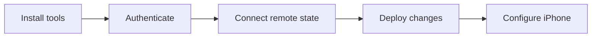
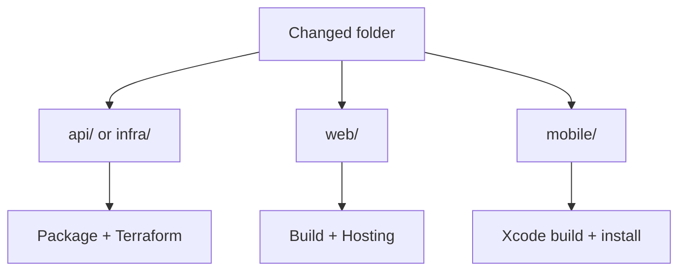

# Setup and deployment

[日本語](setup-jp.md) · [Folders](README.md) · [Tech](tech.md)

Run commands from the repository root unless stated otherwise.
Existing project: **beatavue / 256425564793**, Tokyo. It is already deployed.



## 1. Tools and authentication

| Tool | Requirement |
| --- | --- |
| Xcode | iOS/watchOS SDKs; HealthKit-capable signing team for devices |
| Python | 3.12+ |
| Node.js | 22.12+ |
| Terraform | 1.6+ |
| Google Cloud CLI | `gcloud` |
| Firebase CLI | 15.33.0 |
| Java | 21+; only for the Firestore emulator |

Install Google Cloud CLI and Terraform using their official installers. Install the project dependencies:

```sh
python3 -m venv .venv
.venv/bin/python -m pip install -r api/requirements-dev.txt
npm --prefix web ci
npm install --prefix /tmp/beatavue-cli firebase-tools@15.33.0
export PATH="/tmp/beatavue-cli/node_modules/.bin:$PATH"
```

Authenticate locally; CI uses Workload Identity Federation instead.

```sh
gcloud auth login
gcloud auth application-default login
gcloud config set project beatavue
gcloud auth application-default set-quota-project beatavue
firebase login --reauth
gcloud projects describe beatavue --format='value(projectNumber)'
gcloud billing projects describe beatavue
```

Confirm project number `256425564793` and active billing. The operator needs permissions to
manage this stack and act as its service accounts. Use short-lived credentials; no service-account keys.

## 2. Connect the existing deployment

```sh
terraform -chdir=infra init -reconfigure -backend-config=backend.hcl.example
```

On a new checkout, restore the nonsecret function settings from remote state **before planning**:

```sh
python3 - <<'PYTHON'
import json, re, subprocess
from pathlib import Path
state = json.loads(subprocess.check_output(
    ["terraform", "-chdir=infra", "show", "-json"], text=True))
api = next(r["values"] for r in state["values"]["root_module"]["resources"]
           if r["address"] == "google_cloudfunctions2_function.api[0]")
values = {
    "deploy_functions": True,
    "source_object": api["build_config"][0]["source"][0]["storage_source"][0]["object"],
    "upload_token_version": api["service_config"][0]["secret_environment_variables"][0]["version"],
    "region": api["location"],
}
path = Path("infra/terraform.tfvars")
existing = path.read_text() if path.exists() else ""
pattern = r"(?m)^\s*(?:deploy_functions|source_object|upload_token_version|region)\s*=.*(?:\n|$)"
kept = re.sub(pattern, "", existing)
path.write_text(kept + "\n" + "".join(
    f"{key} = {json.dumps(value)}\n" for key, value in values.items()))
print("Saved infra/terraform.tfvars")
PYTHON
```

This writes ignored settings, not the token. Preserve any separately configured budget settings.
Without these values, the default `deploy_functions=false` would plan function removal.
If no deployed API exists in state, use the empty-stack procedure below instead.

```sh
terraform -chdir=infra plan
```

An unchanged checkout should report no changes. Inspect unexpected changes before applying.
Do not commit `terraform.tfvars`, state, plans, credentials, or tokens.

## 3. Provision an empty stack only

**Skip this section for the current deployment.** Use it only when provisioning an empty stack
in the same project. Inspect existing databases, buckets, secrets, service accounts, queues,
indexes, and Firestore rules; import matching resources and preserve other applications' rules.

```sh
gcloud services enable cloudresourcemanager.googleapis.com cloudbilling.googleapis.com --project beatavue
gcloud firestore databases list --project beatavue
gcloud functions list --gen2 --project beatavue
gcloud storage buckets list --project beatavue
```

Create the state bucket only if absent:

```sh
gcloud storage buckets create gs://beatavue-terraform-state \
  --project=beatavue --location=asia-northeast1 --uniform-bucket-level-access
gcloud storage buckets update gs://beatavue-terraform-state \
  --versioning --public-access-prevention
```

Restrict its IAM to deployment operators/CI. Attach Firebase and create its site only if absent:

```sh
firebase projects:addfirebase beatavue
firebase hosting:sites:list --project beatavue
# Only if the default site is absent:
firebase hosting:sites:create beatavue --project beatavue
```

```sh
terraform -chdir=infra init -reconfigure -backend-config=backend.hcl.example
# Only if an existing default database needs importing:
terraform -chdir=infra import 'google_firestore_database.default[0]' \
  'projects/beatavue/databases/(default)'
terraform -chdir=infra plan -var='deploy_functions=false' -out=bootstrap.tfplan
terraform -chdir=infra apply bootstrap.tfplan
```

Keep an existing database's immutable location; adjust `region` before planning. The first
apply creates infrastructure and an empty secret container. Index creation can take several minutes.

Create a high-entropy token in a password manager, retain the owner's copy, and add it through
Secret Manager or stdin. Never pass its value as a command argument or Terraform variable.

```sh
gcloud secrets versions add beatavue-upload-token --project beatavue --data-file=-
```

Paste the token into stdin and finish with Control-D. Record the numeric version, then deploy
API and web using section 5. No Firebase app registration or Authentication setup is needed.

## 4. First iPhone/Watch setup

1. Open `mobile/ios/Beatavue/Beatavue.xcodeproj`. Select the signing team for iPhone and Watch.
2. Build/run on the physical iPhone and paired Watch. Allow the requested Health permissions.
3. In iPhone cloud settings, set the base URL to `https://beatavue.web.app`.
4. Open macOS **Keychain Access → login**, find **Beatavue upload token**, account **owner**,
   and authenticate to show/copy the password. For another machine, retrieve the owner's token
   securely from the password manager or Secret Manager console.
5. Enter it in the app's SecureField, save, and confirm **Enable public publishing**.
6. Tap **Sync now**, then verify matching measurements on the web. For live heart rate, start
   a Watch workout explicitly. Background sync still needs physical-device acceptance.

Publishing shares data with everyone. Pause retains cloud history; Delete cloud history hides
and purges it. Retry the same deletion until it completes. No reset is needed for the timestamp
fix: the updated app automatically recovers affected queued batches on launch.

## 5. Deploy changes



### API or infrastructure

Use section 2's restored settings. Choose an existing numeric secret version:

```sh
UPLOAD_TOKEN_VERSION=1 sh scripts/deploy-api.sh
```

The script packages source, uploads its immutable ZIP, prints a saved Terraform plan, and applies it. After a successful deploy, **repeat section 2's restore block** to persist the
new source filename/version. Preserve any configured budget settings.

For infrastructure-only edits with the existing source:

```sh
terraform -chdir=infra fmt -check
terraform -chdir=infra validate
terraform -chdir=infra plan -out=changes.tfplan
terraform -chdir=infra apply changes.tfplan
```

### Web

```sh
sh scripts/deploy-web.sh
```

If the Firebase CLI reports 401, run `firebase login --reauth` and retry. Deploy the API first
when changing its service name or region; update the Hosting rewrite in `firebase.json` too.
Hosting explicitly selects site `beatavue` in `firebase.json`; keep this setting to avoid
the CLI's “no site name or target name” error.

### iPhone/Watch

```sh
cd mobile/ios/Beatavue
make lint
```

Build with Xcode MCP `BuildProject`, then run/install through Xcode. Do not run Swift test suites
unless requested. An iOS-only change does not require redeploying the API.

### GitHub Actions

Configure GitHub environment **gcp**:

| Variable | Value |
| --- | --- |
| `GCP_WORKLOAD_IDENTITY_PROVIDER` | Repository/environment-restricted WIF provider |
| `GCP_DEPLOY_SERVICE_ACCOUNT` | Infrastructure deployment service account |
| `GCP_BILLING_ACCOUNT` | Optional; match existing budget configuration |

Grant the designated GitHub identity impersonation and the deployment account state/source
access, resource/IAM management, and service-account act-as permissions. WIF bootstrap is
external to this Terraform stack. Dispatch **Deploy Scope 2** with `all`, `api`, or `web` and an
existing numeric token version. Push/PR validation runs separately; it does not deploy.

## 6. Local development and verification

In separate terminals:

```sh
firebase emulators:start --only firestore --project demo-beatavue
```

```sh
cd api
FIRESTORE_EMULATOR_HOST=127.0.0.1:8081 GOOGLE_CLOUD_PROJECT=demo-beatavue \
  ../.venv/bin/functions-framework --target api --port 8080
```

```sh
cd web
npm run dev
```

The dashboard proxies `/v1` to port 8080. Supply a separate local `UPLOAD_TOKEN` through the
environment only if exercising private API calls. Use synthetic data and emulator projects.

Backend checks, with the emulator running for integration coverage:

```sh
FIRESTORE_EMULATOR_HOST=127.0.0.1:8081 .venv/bin/python -m pytest -c api/pytest.ini api/tests -q
npm --prefix web run build
terraform -chdir=infra fmt -check
terraform -chdir=infra validate
```

After deployment:

```sh
curl --fail https://beatavue.web.app/v1/sync-status
terraform -chdir=infra plan -detailed-exitcode
```

Expect HTTP 200 and Terraform exit code 0 for no drift. Verify private calls reject invalid
tokens; check synthetic ingestion, retries, queries, and cleanup before publishing real data.
On devices, check offline/relaunch recovery, locked-device transfers, deletions, and Watch mirroring.

## 7. Token rotation and alerts

Add a new Secret Manager version outside Terraform. Deploy the API with that numeric version,
then update the iPhone token at the same endpoint. Its queue and anchors remain intact.
Retire old API revisions/tags that reference the previous version, disable the old secret version,
and verify the old token is rejected through both Hosting and the direct API.

Optional budget: set `billing_account` and `budget_amount` in ignored Terraform variables.
The proposed amount is USD 10/month; alerts do not cap spending. Keep CI variables consistent.
Add Monitoring notification channels for external delivery. Neither a budget nor external
notification channels are currently configured.
