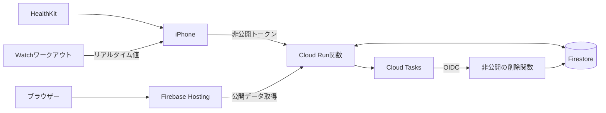
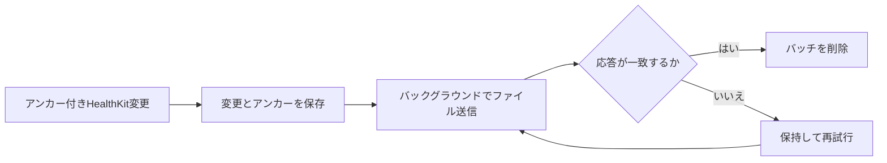
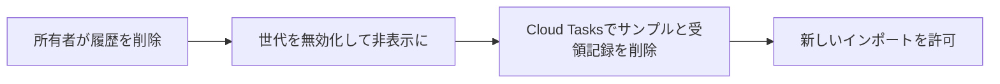

# 技術メモ

[English](tech.md) · [フォルダー](README-jp.md) · [セットアップ](setup-jp.md)

## 構成



| フォルダー | 技術 |
| --- | --- |
| `mobile/ios/Beatavue/` | SwiftUI、HealthKit、Charts、ワークアウトのミラーリング |
| `api/` | Python 3.12、Functions Framework、Pydantic、Firestore SDK |
| `web/` | React、TypeScript、Vite、Luxon |
| `infra/` | Terraform、GCP IAM、Firestore、Secret Manager、Cloud Tasks |
| `scripts/` | 内容が変わらないソースパッケージの作成とデプロイ |

プロジェクト: **beatavue**、番号 **256425564793**。リージョン: **asia-northeast1**。
ダッシュボード・APIベース: [beatavue.web.app](https://beatavue.web.app)。
直接アクセス用API: [beatavue-api-r4x2cqmxbq-an.a.run.app](https://beatavue-api-r4x2cqmxbq-an.a.run.app)。

## 測定データ

- 心拍数: `heart_rate`、bpm。HRV: `hrv_sdnn`、ms。リアルタイムHRVは対象外。
- 読み取り可能な全ソースを保持。同じ時刻の測定も統合しない。
- 平均は各サンプルを同じ重みで計算。測定の空白を補間しない。
- iPhoneはローカル履歴を読み、明示的に開始したWatchワークアウトをミラーリングする。リアルタイム値は端末内のみ。
- Webの日表示は生の測定点、週・月表示は日別サンプル平均。週は月曜始まり。
- 選択したタイムゾーンと夏時間で期間を計算。表示中は2分ごとに更新。
- 公開は初期状態で無効。有効化すると当日と過去29日、その後の変更を公開する。

## 永続的な同期



- サンプルUUIDとバッチIDを固定し、再試行で重複させない。同じバッチIDで内容を変更すると409。
- インポートごとの世代で制御。古い送信で削除済み世代を復活させない。
- 削除済みUUIDの印を保持し、遅れて届く追加より削除を優先する。
- キューとアンカーを一括保存。固定インポート範囲ごとに独立したアンカーを持つ。
- 永続キューは完全なファイル保護を使い、バックアップから除外する。
- 一時送信ファイルは初回ロック解除後に読み取り可能とし、ロック中のバックグラウンド転送に対応する。
- トークンは初回ロック解除後に使える端末専用Keychainに保存。リダイレクトは拒否する。
- 再起動時に転送を再接続。一時的な失敗は指数バックオフとランダムな遅延で再試行する。
- 旧形式の時刻のみのデータはHealthKitから再取得。待機中の削除と正常なバッチIDは保持する。
- HealthKitのバックグラウンド通知は保証されない。フォアグラウンドで追いつく。読み取り権限の拒否は判定できない。

## API

全ルートはサーバーが選ぶ単一所有者のデータを使う。公開応答にはUUID、端末情報、非公開のソース識別子を含めない。
変更リクエストには`Authorization: Bearer <token>`と`Content-Type: application/json`を使う。

| メソッド | ルート | アクセス | リクエスト・結果 |
| --- | --- | --- | --- |
| POST | `/v1/import` | 非公開 | 固定`import_id` → `generation` |
| POST | `/v1/sync` | 非公開 | バッチ → 永続的な受領確認 |
| GET | `/v1/samples` | 公開 | `metric`、`from`、`to`、任意で`limit`、`cursor` |
| GET | `/v1/summaries` | 公開 | `metric`、`from`、`to`、任意で`timezone`、`bucket` |
| GET | `/v1/sync-status` | 公開 | 最後に取り込んだ時刻 |
| DELETE | `/v1/data` | 非公開 | 固定`deletion_id`と`generation` → 削除状況 |

架空データのバッチ例:

```json
{
  "schema_version": 1,
  "generation": "00000000-0000-4000-8000-000000000001",
  "batch_id": "00000000-0000-4000-8000-000000000002",
  "operations": [{
    "kind": "upsert",
    "uuid": "00000000-0000-4000-8000-000000000003",
    "sample": {
      "uuid": "00000000-0000-4000-8000-000000000003",
      "metric": "heart_rate", "value": 72, "unit": "bpm",
      "start": "2026-10-09T01:00:00.123Z",
      "end": "2026-10-09T01:00:00.123Z",
      "source_name": "Apple Health", "source_identifier": "example.source"
    }
  }]
}
```

削除操作: `{"kind":"delete","uuid":"<sample UUID>"}`。任意の非公開メタデータ:
`source_version`、`device_name`、`device_model`。受領確認は`batch_id`、`generation`、
`acknowledged`、`ingested_at`を返す。

| 制限 | 値 |
| --- | --- |
| バッチ | 最大100操作・256 KiB。同じUUIDの操作は1つ |
| 期間 | `from`を含み、`to`を含まない。経過時間で最大32日 |
| ページ | 1〜500サンプル。クエリに紐づく不透明なカーソル |
| 集計 | 最大20,000サンプル。UTCの時間別または現地の日別 |
| 公開枠 | 全体で毎分60リクエスト・予約読み取り100,000サンプル |
| キャッシュ | `no-store`。応答前に世代を再確認 |

時刻には日付とタイムゾーンが必須。値は正数、単位は測定種別と一致させる。
公開枠は負荷を抑えるための制限であり、課金の上限ではない。統計はサンプル単位。
`latest`は指定期間内に限る。

| ステータス | 意味 |
| --- | --- |
| 400 / 413 | 不正なリクエスト / サイズ超過 |
| 401 | トークンが不正 |
| 409 | 世代・削除処理・カーソル・バッチの競合 |
| 422 | 集計対象が多すぎる。期間を短くする |
| 429 | 公開枠を超過。`Retry-After`に従う |
| 503 | 一時的な失敗。同じIDで再試行 |

## 削除とアクセス



削除は200件ずつ処理し、失敗時も再試行する。廃止した世代の印は残すが、測定データは含まない。
202は削除中。同じ削除IDで200になるまで確認する。タスク登録に失敗しても世代は無効のまま。
端末のAppleヘルスケアとローカル履歴は削除しない。

公開データの取得にアカウントは不要。変更には所有者トークンが必要。削除関数はCloud Tasksの
IAM呼び出しだけを許可する。Firestoreへの直接アクセスは拒否。APIトークンはWeb資産、
リポジトリ、Terraform状態に含めない。Firebase Authenticationは使わない。

## 基盤と検証

TerraformでAPIサービス、IAM、データベース・索引・ルール、ソース保存、イメージ、関数、
シークレット容器、キュー、サーバーエラー監視を管理する。状態は非公開のGCSでバージョン管理。
Firebaseプロジェクト・サイトの初期化とトークン値の登録はTerraform外で行う。

両関数は1 CPU・256 MiB、最小インスタンス数0。APIは最大2、同時処理8、タイムアウト55秒。
削除関数は最大1、同時処理1、タイムアウト60秒。任意の予算通知には請求先アカウント、
外部への監視通知には通知チャネルが必要。

ローカルでAPI動作、Firestoreエミュレーター、Webビルド、Terraform、Xcodeビルドを検証。
2026-10-10の実環境では架空データで認証、クエリ・索引、再試行、削除優先、世代制御、
Cloud Tasks削除、削除関数IAM、Hostingルーティングを確認。架空データは削除済み。
iOSの時刻修正はXcodeでペイロードとキュー復旧を確認。実機のバックグラウンド動作、
トークン更新、負荷、外部通知は引き続き検証が必要。
