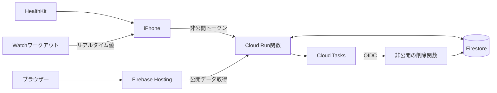
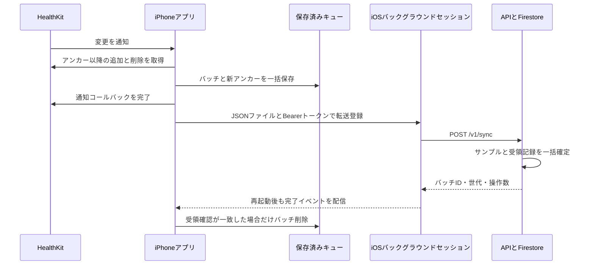
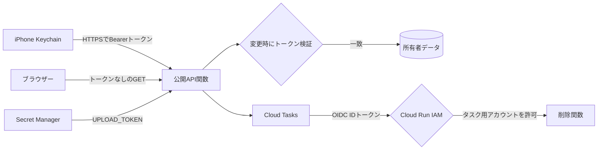
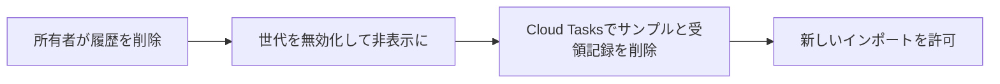

# 技術メモ

[English](tech.md) · [フォルダー](README-jp.md) · [セットアップ](setup-jp.md)

## 構成



| フォルダー | 技術 |
| --- | --- |
| `mobile/ios/Beatavue/` | SwiftUI、HealthKit、Charts、ワークアウトのミラーリング |
| `api/` | Python 3.12、Functions Framework、Pydantic、Firestore SDK |
| `web/` | React、TypeScript、Vite、Luxon |
| `infra/` | Terraform、GCP IAM、Firestore、Secret Manager、Cloud Tasks |
| `scripts/` | 内容が変わらないソースパッケージの作成とデプロイ |

プロジェクト: **beatavue**、番号 **256425564793**。リージョン: **asia-northeast1**。
ダッシュボード・APIベース: [beatavue.web.app](https://beatavue.web.app)。
直接アクセス用API: [beatavue-api-r4x2cqmxbq-an.a.run.app](https://beatavue-api-r4x2cqmxbq-an.a.run.app)。

## 測定データ

- 心拍数: `heart_rate`、bpm。HRV: `hrv_sdnn`、ms。リアルタイムHRVは対象外。
- 読み取り可能な全ソースを保持。同じ時刻の測定も統合しない。
- 平均は各サンプルを同じ重みで計算。測定の空白を補間しない。
- iPhoneはローカル履歴を読み、明示的に開始したWatchワークアウトをミラーリングする。リアルタイム値は端末内のみ。
- Webの日表示は生の測定点、週・月表示は日別サンプル平均。週は月曜始まり。
- 選択したタイムゾーンと夏時間で期間を計算。表示中は2分ごとに更新。
- 公開は初期状態で無効。有効化すると当日と過去29日、その後の変更を公開する。

## バックグラウンドアップロード

処理は2段階。アプリがHealthKitの変更を永続キューに保存し、そのキューのファイルをiOSが転送する。収集にはアプリの実行が必要だが、登録済みの転送はバックグラウンド`URLSession`を使う。実行時刻はiOSが決めるため、HealthKitの「即時」通知は即時公開を保証しない。



### 収集と保存

1. **公開には明示的な有効化が必要。** 固定のインポートIDを保存し、`/v1/import`を呼び、返された世代を保存する。初期範囲は今日の29日前から始まり、今日と今後のサンプルを含む。世代は公開単位を表し、削除済みの世代からの送信をサーバーが拒否するために使う。[enable()](mobile/ios/Beatavue/Beatavue/CloudSync.swift#L305)、[世代の検証](api/repository.py#L61)。
2. **変更通知で収集する。** 測定種別ごとに監視クエリを登録し、`.immediate`のバックグラウンド通知を要求する。通知時は`syncNow()`で収集し、HTTP応答を待たずにコールバックを完了する。アプリを開いたときも未取得分を収集する。[HealthKit監視](mobile/ios/Beatavue/Beatavue/CloudSync.swift#L426)、[フォアグラウンドでの収集](mobile/ios/Beatavue/Beatavue/ContentView.swift#L41)。
3. **アンカーは取得位置のしおり。** 測定種別と固定インポート範囲ごとにアンカーを持ち、前回以降の追加・削除を100件ずつ取得する。追加は`upsert`、削除は`delete`に変換。同じページで同一UUIDの追加と削除があれば削除を優先する。[アンカー付き取得](mobile/ios/Beatavue/Beatavue/CloudSync.swift#L469)。
4. **しおりを進める前に保存する。** 最大100操作のバッチに分割し、それぞれ固定IDを付ける。バッチと新アンカーを同じファイルの原子的な置換で保存し、変更を失ったままアンカーだけが進むことを防ぐ。メモリー上の状態も書き込み成功後に更新する。[バッチとアンカーの更新](mobile/ios/Beatavue/Beatavue/CloudSync.swift#L485)、[原子的な保存](mobile/ios/Beatavue/Beatavue/CloudSync.swift#L279)。

### ファイル転送の登録

先頭のバッチから順番に、1つの転送を実行する。JSON化して256 KiB以内かを確認し、Keychainのトークンを読み、`POST /v1/sync`のファイル送信タスクを作る。タスクの説明文字列で各試行と固定バッチIDを対応付ける。[送信スケジューラー](mobile/ios/Beatavue/Beatavue/CloudSync.swift#L506)。

セッションは固定識別子を使い、バックグラウンド起動イベントを要求し、接続が戻るまで待つ。リソースのタイムアウトは24時間、リクエストは60秒。これらは設定値であり、配信時刻の保証ではない。[バックグラウンドセッション設定](mobile/ios/Beatavue/Beatavue/CloudSync.swift#L146)。

| ファイル | 保護 | 用途 |
| --- | --- | --- |
| `state.json` | `.completeFileProtection` | 永続キューとアンカー。ロック中は保護する。 |
| `upload-<バッチID>.json` | `.completeFileProtectionUntilFirstUserAuthentication` | 起動後の初回ロック解除後は、ロック中も転送サービスが準備済みコピーを開けるようにする。 |

保護を緩めるのは一時送信用コピーだけ。フォルダーはバックアップから除外し、受領確認が一致するとコピーを削除する。ロック中に永続キューの読み込みや保存ができなければ、未完了の処理を後で再試行する。ロック解除してアプリを開くと追いつける。[バックアップ除外](mobile/ios/Beatavue/Beatavue/CloudSync.swift#L267)、[送信ファイルの保護](mobile/ios/Beatavue/Beatavue/CloudSync.swift#L513)、[受領確認の保存失敗](mobile/ios/Beatavue/Beatavue/CloudSync.swift#L569)。

### 完了、再試行、再接続

**受領確認は対象バッチと一致する必要がある。** 転送エラーなし、HTTP 200、`batch_id`・`generation`・`acknowledged`が待機中のバッチと一致した場合だけ削除する。更新したキューを保存してから一時ファイルを削除し、次のバッチを送る。[受領確認の検証](mobile/ios/Beatavue/Beatavue/CloudSync.swift#L529)。

**同じバッチの再送は安全。** Firestoreはサンプル変更と受領記録を1つのトランザクションで確定する。記録には検証済みペイロードのハッシュと応答を保存する。確定後に応答が失われても、同じ内容の再送には保存済み応答を返す。同じIDで内容を変えると409。削除済みの印で、遅れた追加による復活も防ぐ。[ペイロードのハッシュ](api/main.py#L140)、[トランザクションと受領記録](api/repository.py#L55)。

**一時的な失敗でもキューを保持する。** 遅延は10秒から倍増し、最大1時間に0〜10秒のランダムな遅延を加える。保存した`retryAt`を次のタスクの開始可能時刻に設定する。400・401・409・413ではバッチを保持してエラーを表示し、その完了処理から次の試行を自動登録しない。原因を修正して「今すぐ同期」を使う。[再試行処理](mobile/ios/Beatavue/Beatavue/CloudSync.swift#L552)、[開始可能時刻](mobile/ios/Beatavue/Beatavue/CloudSync.swift#L523)。

**再起動時は既存タスクに再接続する。** キューを読み、バックグラウンドタスクを列挙する。先頭バッチに対応するタスクを引き継ぎ、他を取り消してから追加の送信を登録する。iOSからバックグラウンドイベントが届くとアプリデリゲートがセッションを再接続し、イベント配信完了後にシステムの完了ハンドラーを呼ぶ。[タスク復元](mobile/ios/Beatavue/Beatavue/CloudSync.swift#L237)、[アプリデリゲート](mobile/ios/Beatavue/Beatavue/CloudSync.swift#L592)、[イベント完了](mobile/ios/Beatavue/Beatavue/CloudSync.swift#L213)。

一時停止ではキューとアンカーを残し、収集と転送を取り消す。旧形式の時刻だけを含むバッチはアンカーを消して追加分をHealthKitから再取得し、待機中の削除は残す。[一時停止](mobile/ios/Beatavue/Beatavue/CloudSync.swift#L335)、[旧形式の復旧](mobile/ios/Beatavue/Beatavue/CloudSync.swift#L74)。実機のバックグラウンド動作は引き続き検証が必要。

## 認証

アクセス経路は公開閲覧、所有者による変更、サービス間の削除処理の3つ。所有者トークンは単一の所有者データを変更する権限を与え、個々のユーザーを識別するものではない。



### 所有者トークン：iPhoneからAPIへ

所有者がHTTPSのベースURLと共通のアップロードトークンを設定する。iPhoneはヘルスデータと分離し、Keychainの汎用パスワード（`com.kinn.Beatavue.cloud` / `upload-token`）として保存する。`AfterFirstUnlockThisDeviceOnly`により起動後の初回ロック解除後に利用でき、この端末専用になる。アプリは32文字以上を要求する。[URLの検証](mobile/ios/Beatavue/Beatavue/CloudSync.swift#L285)、[Keychain保存](mobile/ios/Beatavue/Beatavue/CloudSync.swift#L98)。初期設定で使うmacOS Keychainのコピーとは別で、iPhoneは自身のKeychain項目を読む。

アップロードは`Authorization: Bearer <token>`を送る。インポートと削除の制御リクエストも一時セッションで同じヘッダーを使う。両経路ともHTTPリダイレクトを拒否し、設定先がトークン付きリクエストを別の宛先に転送することを防ぐ。[送信ヘッダー](mobile/ios/Beatavue/Beatavue/CloudSync.swift#L519)、[制御リクエスト](mobile/ios/Beatavue/Beatavue/CloudSync.swift#L572)、[リダイレクト拒否](mobile/ios/Beatavue/Beatavue/CloudSync.swift#L178)。

GCPではAPI用サービスアカウントにSecret Managerの読み取り権限を付け、指定バージョンを`UPLOAD_TOKEN`として注入する。Terraformは参照先とバージョンを保持し、値は別途登録する。[シークレット読取権限](infra/main.tf#L97)、[シークレット注入](infra/main.tf#L245)。

APIは**処理ハンドラーを実行する前に**、`POST /v1/import`・`POST /v1/sync`・`DELETE /v1/data`を検証する。Bearerヘッダー全体を`hmac.compare_digest`で設定値と比較する。未指定、不一致、サーバー設定値が32文字未満の場合は401。[トークン比較](api/main.py#L36)、[ルートの認証](api/main.py#L133)。

固定の共通シークレットであり、ログイン、更新用トークン、自動失効はない。更新時は新しいシークレットバージョンの作成、そのバージョンを使うデプロイ、iPhoneのトークン更新が必要。[セットアップ](setup-jp.md)を参照。

### 公開取得と内部ID

**公開閲覧：** Cloud RunはAPI関数の呼び出しを`allUsers`に許可し、Pythonのルート認証までリクエストを通す。対応するGETルートはトークン不要。公開サンプルからUUID、端末情報、非公開のソース識別子を除く。URLが分かれば公開測定値を閲覧できる。[公開APIのIAM](infra/main.tf#L257)、[公開ルート](api/main.py#L150)、[公開サンプルの項目](api/main.py#L69)。

**削除処理：** APIは`beatavue-tasks`のOIDC IDトークンと、削除関数URLを対象（audience）に指定したCloud Taskを登録する。実行前にCloud Run IAMがIDを検証し、Terraformがこのアカウントに呼び出し権限を付ける。所有者トークンは削除関数の認証情報として使わない。[OIDC付きタスク](api/main.py#L93)、[タスクIDの使用権限](infra/main.tf#L166)、[削除関数の呼出権限](infra/main.tf#L208)。

**データベース：** APIと削除関数は実行用サービスアカウントと`roles/datastore.user`を使う。ブラウザーとiPhoneはAPI経由でアクセスし、Firestoreルールはクライアントの直接読み書きを拒否する。クライアント向けルールとサーバーIAMは別で、サーバーSDKはIAMで認可される。[DBのIAM](infra/main.tf#L47)、[サーバーSDKクライアント](api/repository.py#L23)、[直接アクセス拒否ルール](infra/firestore.rules#L4)。Firebase Authenticationは使わない。

## API

全ルートはサーバーが選ぶ単一所有者のデータを使う。公開応答にはUUID、端末情報、非公開のソース識別子を含めない。
変更リクエストには`Authorization: Bearer <token>`と`Content-Type: application/json`を使う。

| メソッド | ルート | アクセス | リクエスト・結果 |
| --- | --- | --- | --- |
| POST | `/v1/import` | 非公開 | 固定`import_id` → `generation` |
| POST | `/v1/sync` | 非公開 | バッチ → 永続的な受領確認 |
| GET | `/v1/samples` | 公開 | `metric`、`from`、`to`、任意で`limit`、`cursor` |
| GET | `/v1/summaries` | 公開 | `metric`、`from`、`to`、任意で`timezone`、`bucket` |
| GET | `/v1/sync-status` | 公開 | 最後に取り込んだ時刻 |
| DELETE | `/v1/data` | 非公開 | 固定`deletion_id`と`generation` → 削除状況 |

架空データのバッチ例:

```json
{
  "schema_version": 1,
  "generation": "00000000-0000-4000-8000-000000000001",
  "batch_id": "00000000-0000-4000-8000-000000000002",
  "operations": [{
    "kind": "upsert",
    "uuid": "00000000-0000-4000-8000-000000000003",
    "sample": {
      "uuid": "00000000-0000-4000-8000-000000000003",
      "metric": "heart_rate", "value": 72, "unit": "bpm",
      "start": "2026-10-09T01:00:00.123Z",
      "end": "2026-10-09T01:00:00.123Z",
      "source_name": "Apple Health", "source_identifier": "example.source"
    }
  }]
}
```

削除操作: `{"kind":"delete","uuid":"<sample UUID>"}`。任意の非公開メタデータ:
`source_version`、`device_name`、`device_model`。受領確認は`batch_id`、`generation`、
`acknowledged`、`ingested_at`を返す。

| 制限 | 値 |
| --- | --- |
| バッチ | 最大100操作・256 KiB。同じUUIDの操作は1つ |
| 期間 | `from`を含み、`to`を含まない。経過時間で最大32日 |
| ページ | 1〜500サンプル。クエリに紐づく不透明なカーソル |
| 集計 | 最大20,000サンプル。UTCの時間別または現地の日別 |
| 公開枠 | 全体で毎分60リクエスト・予約読み取り100,000サンプル |
| キャッシュ | `no-store`。応答前に世代を再確認 |

時刻には日付とタイムゾーンが必須。値は正数、単位は測定種別と一致させる。
公開枠は負荷を抑えるための制限であり、課金の上限ではない。統計はサンプル単位。
`latest`は指定期間内に限る。

| ステータス | 意味 |
| --- | --- |
| 400 / 413 | 不正なリクエスト / サイズ超過 |
| 401 | トークンが不正 |
| 409 | 世代・削除処理・カーソル・バッチの競合 |
| 422 | 集計対象が多すぎる。期間を短くする |
| 429 | 公開枠を超過。`Retry-After`に従う |
| 503 | 一時的な失敗。同じIDで再試行 |

## 削除とアクセス



削除は200件ずつ処理し、失敗時も再試行する。廃止した世代の印は残すが、測定データは含まない。
202は削除中。同じ削除IDで200になるまで確認する。タスク登録に失敗しても世代は無効のまま。
端末のAppleヘルスケアとローカル履歴は削除しない。

公開データの取得にアカウントは不要。変更には所有者トークンが必要。削除関数はCloud Tasksの
IAM呼び出しだけを許可する。Firestoreへの直接アクセスは拒否。APIトークンはWeb資産、
リポジトリ、Terraform状態に含めない。Firebase Authenticationは使わない。

## 基盤と検証

TerraformでAPIサービス、IAM、データベース・索引・ルール、ソース保存、イメージ、関数、
シークレット容器、キュー、サーバーエラー監視を管理する。状態は非公開のGCSでバージョン管理。
Firebaseプロジェクト・サイトの初期化とトークン値の登録はTerraform外で行う。

両関数は1 CPU・256 MiB、最小インスタンス数0。APIは最大2、同時処理8、タイムアウト55秒。
削除関数は最大1、同時処理1、タイムアウト60秒。任意の予算通知には請求先アカウント、
外部への監視通知には通知チャネルが必要。

ローカルでAPI動作、Firestoreエミュレーター、Webビルド、Terraform、Xcodeビルドを検証。
2026-10-10の実環境では架空データで認証、クエリ・索引、再試行、削除優先、世代制御、
Cloud Tasks削除、削除関数IAM、Hostingルーティングを確認。架空データは削除済み。
iOSの時刻修正はXcodeでペイロードとキュー復旧を確認。実機のバックグラウンド動作、
トークン更新、負荷、外部通知は引き続き検証が必要。
