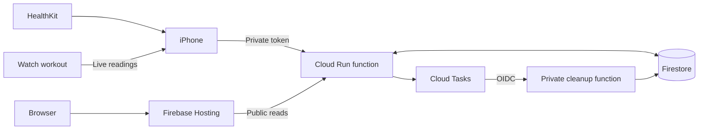
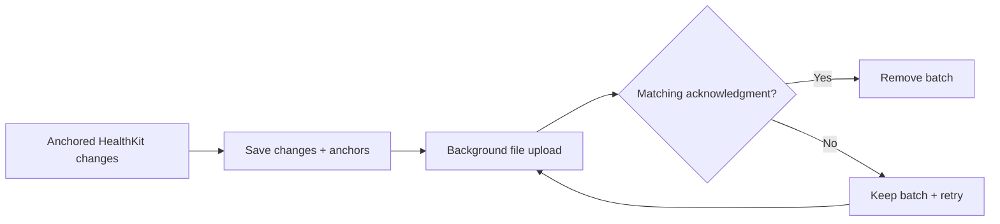
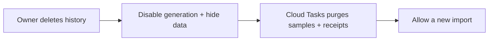

# Technical notes

[日本語](tech-jp.md) · [Folders](README.md) · [Setup](setup.md)

## Architecture



| Folder | Technology |
| --- | --- |
| `mobile/ios/Beatavue/` | SwiftUI, HealthKit, Charts, workout mirroring |
| `api/` | Python 3.12, Functions Framework, Pydantic, Firestore SDK |
| `web/` | React, TypeScript, Vite, Luxon |
| `infra/` | Terraform, GCP IAM, Firestore, Secret Manager, Cloud Tasks |
| `scripts/` | Immutable source packaging and deployment |

Project: **beatavue**, number **256425564793**. Region: **asia-northeast1**.
Dashboard/API base: [beatavue.web.app](https://beatavue.web.app).
Direct API: [beatavue-api-r4x2cqmxbq-an.a.run.app](https://beatavue-api-r4x2cqmxbq-an.a.run.app).

## Measurements

- Heart rate: `heart_rate`, bpm. HRV: `hrv_sdnn`, ms. No live HRV.
- All accessible sources remain; overlapping timestamps do not merge measurements.
- Averages weight each available sample equally. Gaps remain visible.
- iPhone reads local history and mirrors an explicit Watch workout. Live readings stay local.
- Web day views show raw points; week/month views show daily sample averages. Weeks start Monday.
- Calendar boundaries use the selected timezone, including DST. Visible pages refresh every two minutes.
- Publishing starts off. Enabling it publishes the current day and preceding 29 days, then future changes.

## Durable sync



- Stable sample UUIDs and batch IDs make retries idempotent. Reusing a batch ID with changed content returns 409.
- A generation fences each import. Old uploads cannot restore a deleted generation.
- Tombstones make deletion win over late additions to the same UUID.
- Queue and anchors save atomically. Fixed import windows have independent anchors.
- The durable queue uses complete file protection and is excluded from backups.
- Temporary upload files use protection until first unlock, allowing locked-device background transfers.
- The token uses device-only Keychain storage after first unlock. Redirects are rejected.
- Relaunch reconnects background tasks. Temporary failures use exponential backoff and jitter.
- Legacy time-only payloads are reread from HealthKit; queued deletions and valid retry IDs survive recovery.
- HealthKit background delivery is best effort; foreground entry catches up. Read-permission denial is not detectable.

## API

All routes use one server-selected owner dataset. Public responses omit UUIDs, device details, and private source identifiers.
Mutation requests use `Authorization: Bearer <token>` and `Content-Type: application/json`.

| Method | Route | Access | Request/result |
| --- | --- | --- | --- |
| POST | `/v1/import` | Private | Stable `import_id` → `generation` |
| POST | `/v1/sync` | Private | Batch → durable acknowledgment |
| GET | `/v1/samples` | Public | `metric`, `from`, `to`, optional `limit`, `cursor` |
| GET | `/v1/summaries` | Public | `metric`, `from`, `to`, optional `timezone`, `bucket` |
| GET | `/v1/sync-status` | Public | Last ingestion time |
| DELETE | `/v1/data` | Private | Stable `deletion_id` + `generation` → cleanup status |

Synthetic batch:

```json
{
  "schema_version": 1,
  "generation": "00000000-0000-4000-8000-000000000001",
  "batch_id": "00000000-0000-4000-8000-000000000002",
  "operations": [{
    "kind": "upsert",
    "uuid": "00000000-0000-4000-8000-000000000003",
    "sample": {
      "uuid": "00000000-0000-4000-8000-000000000003",
      "metric": "heart_rate", "value": 72, "unit": "bpm",
      "start": "2026-10-09T01:00:00.123Z",
      "end": "2026-10-09T01:00:00.123Z",
      "source_name": "Apple Health", "source_identifier": "example.source"
    }
  }]
}
```

Delete operation: `{"kind":"delete","uuid":"<sample UUID>"}`. Optional private sample metadata:
`source_version`, `device_name`, `device_model`. Acknowledgments contain `batch_id`, `generation`,
`acknowledged`, and `ingested_at`.

| Bound | Value |
| --- | --- |
| Batch | ≤100 operations; ≤256 KiB; one operation per UUID |
| Range | `from` inclusive, `to` exclusive; ≤32 elapsed days |
| Page | 1–500 samples; query-bound opaque cursor |
| Summary | ≤20,000 samples; hourly UTC or daily local buckets |
| Public allowance | Shared 60 requests / 100,000 reserved sample reads per minute |
| Caching | `no-store`; generation rechecked before returning data |

Timestamps require the full date and timezone. Values must be positive and units must match the metric.
The public allowance reduces load; it is not a billing cap. Summary statistics are sample-based;
`latest` is restricted to the requested period.

| Status | Meaning |
| --- | --- |
| 400 / 413 | Invalid / oversized request |
| 401 | Invalid token |
| 409 | Generation, cleanup, cursor, or batch conflict |
| 422 | Summary too dense; shorten range |
| 429 | Public limit; honor `Retry-After` |
| 503 | Temporary failure; retry unchanged IDs |

## Deletion and access



Cleanup uses 200-document chunks and durable retries. Retirement markers remain; they contain no sample data.
A 202 response means cleanup is pending; retry the same deletion ID until 200. A scheduling failure
keeps the fence in place. Local Apple Health and history remain untouched.

Public reads need no account. Mutations need the owner token; the cleanup worker accepts only
Cloud Tasks IAM invocation. Direct Firestore clients are denied. The API token is absent from
web assets, repository files, and Terraform state. No Firebase Authentication is used.

## Infrastructure and verification

Terraform manages services, IAM, database/index/rules, source storage, images, functions,
secret container, queue, and server-error monitoring. State is private and versioned in GCS.
Firebase project/site bootstrap and token values are provisioned outside Terraform.

Both functions use one CPU and 256 MiB, with zero minimum instances. API: max two instances,
concurrency eight, timeout 55 seconds. Cleanup: max one instance, concurrency one, timeout 60 seconds.
Optional budget alerts require a billing account; monitoring requires notification channels for external delivery.

Local validation covers API behavior, Firestore emulator integration, web build, Terraform, and Xcode build.
Live synthetic acceptance passed on 2026-10-10: authentication, queries/indexes, retries, tombstones,
fencing, Cloud Tasks cleanup, worker IAM, and Hosting routing. Synthetic data was purged.
The iOS timestamp fix passed Xcode payload/recovery checks. Physical-device background behavior,
token rotation, load behavior, and external alert delivery still need acceptance.
