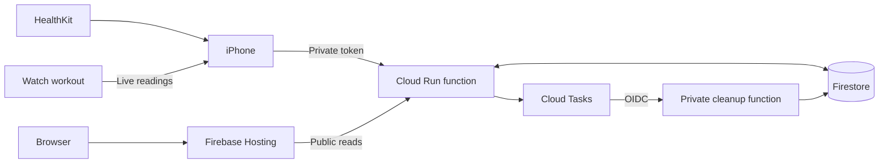
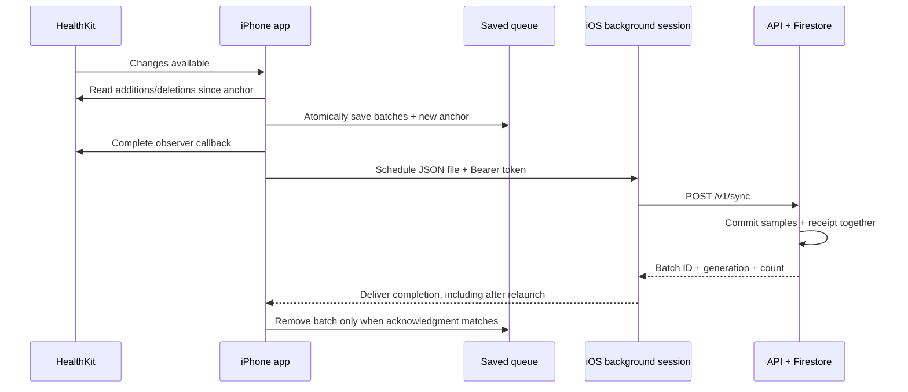
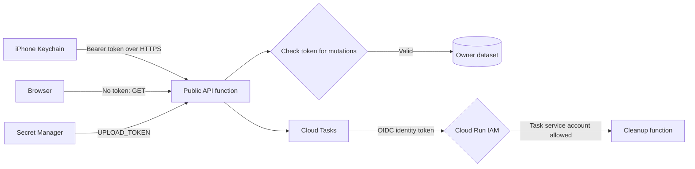
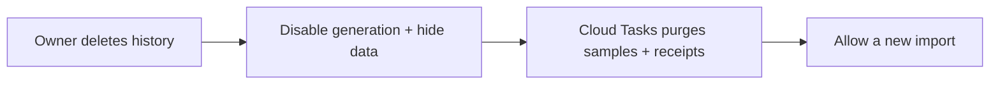

# Technical notes

[日本語](tech-jp.md) · [Folders](README.md) · [Setup](setup.md)

## Architecture



| Folder | Technology |
| --- | --- |
| `mobile/ios/Beatavue/` | SwiftUI, HealthKit, Charts, workout mirroring |
| `api/` | Python 3.12, Functions Framework, Pydantic, Firestore SDK |
| `web/` | React, TypeScript, Vite, Luxon |
| `infra/` | Terraform, GCP IAM, Firestore, Secret Manager, Cloud Tasks |
| `scripts/` | Immutable source packaging and deployment |

Project: **beatavue**, number **256425564793**. Region: **asia-northeast1**.
Dashboard/API base: [beatavue.web.app](https://beatavue.web.app).
Direct API: [beatavue-api-r4x2cqmxbq-an.a.run.app](https://beatavue-api-r4x2cqmxbq-an.a.run.app).

## Measurements

- Heart rate: `heart_rate`, bpm. HRV: `hrv_sdnn`, ms. No live HRV.
- All accessible sources remain; overlapping timestamps do not merge measurements.
- Averages weight each available sample equally. Gaps remain visible.
- iPhone reads local history and mirrors an explicit Watch workout. Live readings stay local.
- Web day views show raw points; week/month views show daily sample averages. Weeks start Monday.
- Calendar boundaries use the selected timezone, including DST. Views load on first selection; Refresh explicitly reloads them. There is no timer, focus, or visibility refresh.
- Publishing starts off. Enabling it publishes the current day and preceding 29 days, then future changes.

## Background upload

### Terms used in this project

| Term | Meaning | Why it matters | Code |
| --- | --- | --- | --- |
| **Generation** | The ID of one cloud publication cycle. Batches belong to this generation; pausing and resuming keeps it. After cloud deletion, a new import uses a new generation. | The server rejects old-generation uploads so delayed transfers cannot restore deleted history. | [Generation check](api/repository.py#L69) |
| **Batch** | An immutable package of up to 100 sample additions or deletions, with a fixed `batch_id` and generation. | Retrying the same package keeps its ID, letting the server recognize it and return the saved acknowledgment. | [Batch payload](mobile/ios/Beatavue/Beatavue/CloudSync.swift#L43), [receipt](api/repository.py#L72) |
| **Anchor** | A HealthKit bookmark recording how far collection has progressed, stored separately for each metric and fixed import window. It tracks collection, not successful upload. | The next query gets changes since that bookmark. Saving it together with queued changes prevents those changes from being skipped. | [Read anchor](mobile/ios/Beatavue/Beatavue/CloudSync.swift#L469), [save anchor](mobile/ios/Beatavue/Beatavue/CloudSync.swift#L491) |
| **Queue** | The ordered list of batches awaiting a matching server acknowledgment, saved in the iPhone’s `state.json`. The first batch uploads first. | Pending changes survive app restarts and transfer failures. This upload queue is separate from the GCP Cloud Tasks queue used for deletion. | [Saved batches](mobile/ios/Beatavue/Beatavue/CloudSync.swift#L67), [upload scheduling](mobile/ios/Beatavue/Beatavue/CloudSync.swift#L506) |

Background upload has two stages: the app collects HealthKit changes into a saved queue, then iOS transfers a file from that queue. Collecting needs the app to run; an already scheduled transfer uses a background `URLSession`. iOS controls timing, so “immediate” HealthKit delivery does not promise immediate publication.



### Collect and save

1. **Publishing requires opt-in.** Enabling publishing saves a stable import ID, calls `/v1/import`, and stores the returned generation. The initial window starts 29 days before today, including today and future samples. The generation identifies this publication session, allowing the server to reject uploads from a deleted session. See [enable()](mobile/ios/Beatavue/Beatavue/CloudSync.swift#L305) and [generation validation](api/repository.py#L69).
2. **Changes trigger collection.** An observer for each metric requests `.immediate` background delivery. Its callback runs `syncNow()` and completes after collection, without waiting for the HTTP response. Opening the app also catches up. See [HealthKit observers](mobile/ios/Beatavue/Beatavue/CloudSync.swift#L426) and [foreground catch-up](mobile/ios/Beatavue/Beatavue/ContentView.swift#L41).
3. **An anchor is a bookmark.** Each metric and fixed import window has its own HealthKit anchor. The query reads additions and deletions since that bookmark, in pages of 100. Additions become `upsert` operations; removals become `delete` operations. Deletion wins if both occur for the same UUID in a page. See [anchored collection](mobile/ios/Beatavue/Beatavue/CloudSync.swift#L469).
4. **Save before moving the bookmark.** Operations become batches of at most 100, each with a fixed ID. New batches and the new anchor are saved together through atomic file replacement. This avoids advancing the anchor while losing the corresponding changes. In-memory state changes only after the write succeeds. See [batch and anchor update](mobile/ios/Beatavue/Beatavue/CloudSync.swift#L485) and [atomic state save](mobile/ios/Beatavue/Beatavue/CloudSync.swift#L279).

### Schedule the file transfer

The scheduler takes the first queued batch and allows one active transfer. It encodes JSON, checks the 256 KiB limit, reads the Keychain token, and creates a `POST /v1/sync` file-upload task. The task description ties each attempt to its stable batch ID. See [upload scheduler](mobile/ios/Beatavue/Beatavue/CloudSync.swift#L506).

The session uses a stable identifier, requests background launch events, waits for connectivity, and sets a 24-hour resource timeout and 60-second request timeout. These settings do not guarantee a delivery time. See [background session configuration](mobile/ios/Beatavue/Beatavue/CloudSync.swift#L146).

| File | Protection | Purpose |
| --- | --- | --- |
| `state.json` | `.completeFileProtection` | Durable queue and anchors; protected while locked. |
| `upload-<batch ID>.json` | `.completeFileProtectionUntilFirstUserAuthentication` | Lets the transfer service reopen a prepared copy while locked after the first unlock since boot. |

Only the temporary upload copy has the weaker protection. The folder is excluded from backup, and the copy is removed after a matching acknowledgment. If loading or saving the protected queue fails while locked, pending work remains for a later retry. Unlocking and opening the app allows it to catch up. See [backup exclusion](mobile/ios/Beatavue/Beatavue/CloudSync.swift#L267), [upload file protection](mobile/ios/Beatavue/Beatavue/CloudSync.swift#L513), and [acknowledgment save failure](mobile/ios/Beatavue/Beatavue/CloudSync.swift#L569).

### Complete, retry, and reconnect

**The acknowledgment must match.** The app removes a batch only when there is no transfer error, status is 200, and `batch_id`, `generation`, and `acknowledged` match the queued batch. It saves the shortened queue before deleting the temporary file or scheduling the next batch. See [acknowledgment checks](mobile/ios/Beatavue/Beatavue/CloudSync.swift#L529).

**Repeating a batch is safe.** Firestore commits sample changes and a receipt in one transaction. The receipt stores the validated payload’s hash and acknowledgment. If the server commits but the response is lost, an unchanged retry returns that saved acknowledgment. Reusing the ID with different content returns 409. Tombstones prevent late additions from restoring deleted samples. See [payload hash](api/main.py#L153) and [transaction and receipt](api/repository.py#L62).

**Temporary failures keep the queue.** Retry delay starts at 10 seconds, doubles up to one hour, and adds 0–10 seconds of jitter. Saved `retryAt` becomes the next task’s earliest start time. For 400, 401, 409, or 413, the completion handler retains the batch and shows an error without automatically scheduling another attempt; correct the problem and use Sync now. See [retry handling](mobile/ios/Beatavue/Beatavue/CloudSync.swift#L552) and [earliest start time](mobile/ios/Beatavue/Beatavue/CloudSync.swift#L523).

**Relaunch reconnects existing work.** Startup loads the queue and enumerates background tasks. It adopts a task matching the first batch and cancels other tasks before scheduling more work. When iOS delivers background events, the app delegate reconnects the session; the system completion handler runs after event delivery finishes. See [task restoration](mobile/ios/Beatavue/Beatavue/CloudSync.swift#L237), [app delegate](mobile/ios/Beatavue/Beatavue/CloudSync.swift#L592), and [event completion](mobile/ios/Beatavue/Beatavue/CloudSync.swift#L213).

Pausing retains the queue and anchors but cancels collection and transfers. Legacy time-only batches are recovered by clearing anchors and rereading additions from HealthKit; queued deletions survive. See [pause](mobile/ios/Beatavue/Beatavue/CloudSync.swift#L335) and [legacy recovery](mobile/ios/Beatavue/Beatavue/CloudSync.swift#L74). Physical-device background behavior still needs acceptance testing.

## Authentication

There are three access paths: public viewing, owner changes, and service-to-service cleanup. The owner token grants permission to change the single owner dataset; it does not identify individual users.



### Owner token: iPhone to API

The owner configures an HTTPS base URL and enters the shared upload token. The iPhone stores it separately from health data as a Keychain generic password (`com.kinn.Beatavue.cloud` / `upload-token`). `AfterFirstUnlockThisDeviceOnly` allows access after the first unlock following boot and keeps the item tied to this device. The app requires at least 32 characters. See [endpoint validation](mobile/ios/Beatavue/Beatavue/CloudSync.swift#L285) and [Keychain storage](mobile/ios/Beatavue/Beatavue/CloudSync.swift#L98). The macOS Keychain copy used during setup is separate; the iPhone reads its own Keychain item.

Uploads send `Authorization: Bearer <token>`. Import and deletion control requests send the same header through an ephemeral session. Both paths reject HTTP redirects, preventing the configured destination from redirecting a token-bearing request. See [upload header](mobile/ios/Beatavue/Beatavue/CloudSync.swift#L519), [control requests](mobile/ios/Beatavue/Beatavue/CloudSync.swift#L572), and [redirect rejection](mobile/ios/Beatavue/Beatavue/CloudSync.swift#L178).

On GCP, the API service account can read the Secret Manager secret. The selected version is injected as `UPLOAD_TOKEN`. Terraform stores the secret reference and version; its value is provisioned separately. See [secret access](infra/main.tf#L97) and [secret injection](infra/main.tf#L245).

The API checks `POST /v1/import`, `POST /v1/sync`, and `DELETE /v1/data` **before executing their handlers**. It compares the complete Bearer header with the configured token using `hmac.compare_digest`. Missing or mismatched credentials, or a configured token shorter than 32 characters, return 401. See [token comparison](api/main.py#L39) and [route guard](api/main.py#L146).

This is a static shared secret with no login, refresh token, or automatic expiry. Rotation requires a new secret version, a deployment selecting it, and an updated iPhone token; see [Setup](setup.md).

### Public reads and internal identities

**Public viewing:** Cloud Run grants `allUsers` invocation of the API function, allowing requests to reach the Python route guard. Supported GET routes need no token. Public sample output omits UUIDs, device information, and private source identifiers. Knowing the URL is sufficient to view published measurements. See [public API IAM](infra/main.tf#L257), [public routes](api/main.py#L163), and [public sample fields](api/main.py#L76).

**Cleanup:** the API creates a Cloud Task with an OIDC identity token using `beatavue-tasks` and the worker URL as its audience. Cloud Run IAM checks that identity before the worker runs; Terraform grants this service account invocation permission. The owner token is not the worker credential. See [OIDC task request](api/main.py#L103), [permission to use task identity](infra/main.tf#L166), and [worker invoker permission](infra/main.tf#L208).

**Database access:** the API and worker use their runtime service accounts with `roles/datastore.user`. Browser and iPhone clients use the API; Firestore rules deny direct client reads and writes. Client rules and server IAM are separate: the server SDK is authorized through IAM. See [database IAM](infra/main.tf#L47), [server SDK client](api/repository.py#L25), and [deny-all client rules](infra/firestore.rules#L4). Firebase Authentication is not used.

## API

All routes use one server-selected owner dataset. Public responses omit UUIDs, device details, and private source identifiers.
Mutation requests use `Authorization: Bearer <token>` and `Content-Type: application/json`.

| Method | Route | Access | Request/result |
| --- | --- | --- | --- |
| POST | `/v1/import` | Private | Stable `import_id` → `generation` |
| POST | `/v1/sync` | Private | Batch → durable acknowledgment |
| GET | `/v1/samples` | Public | `metric`, `from`, `to`, optional `limit`, `cursor` |
| GET | `/v1/summaries` | Public | `metric`, `from`, `to`, optional `timezone`, `bucket` |
| GET | `/v1/sync-status` | Public | Last ingestion time |
| DELETE | `/v1/data` | Private | Stable `deletion_id` + `generation` → cleanup status |

Synthetic batch:

```json
{
  "schema_version": 1,
  "generation": "00000000-0000-4000-8000-000000000001",
  "batch_id": "00000000-0000-4000-8000-000000000002",
  "operations": [{
    "kind": "upsert",
    "uuid": "00000000-0000-4000-8000-000000000003",
    "sample": {
      "uuid": "00000000-0000-4000-8000-000000000003",
      "metric": "heart_rate", "value": 72, "unit": "bpm",
      "start": "2026-10-09T01:00:00.123Z",
      "end": "2026-10-09T01:00:00.123Z",
      "source_name": "Apple Health", "source_identifier": "example.source"
    }
  }]
}
```

Delete operation: `{"kind":"delete","uuid":"<sample UUID>"}`. Optional private sample metadata:
`source_version`, `device_name`, `device_model`. Acknowledgments contain `batch_id`, `generation`,
`acknowledged`, and `ingested_at`.

| Bound | Value |
| --- | --- |
| Batch | ≤100 operations; ≤256 KiB; one operation per UUID |
| Range | `from` inclusive, `to` exclusive; ≤32 elapsed days |
| Page | 1–500 samples; query-bound opaque cursor |
| Summary | ≤20,000 samples; hourly UTC or daily local buckets |
| Public allowance | Shared 60 requests / 100,000 reserved sample reads per minute |
| Caching | HTTP `no-store`; up to 12 loaded web views per page visit; up to 32 aggregate responses per API instance, keyed by generation, publication state, ingestion timestamp, and query. Generation rechecked before returning data. |

Timestamps require the full date and timezone. Values must be positive and units must match the metric.
The public allowance reduces load; it is not a billing cap. Summary statistics are sample-based;
`latest` is restricted to the requested period.

Day views request only paginated samples and compute statistics locally. Week/month views request only summaries.
Both history endpoints include `last_ingestion`, avoiding a separate status request. Refresh clears the web view cache.
A first or invalidated summary still reads up to 20,001 raw sample documents to calculate exact statistics;
unchanged cached summaries skip those sample reads. Public requests still read publication/fence and rate-limit documents.
The API cache is bounded and local to each instance; it is lost on restart. No persistent rollups are maintained.

| Status | Meaning |
| --- | --- |
| 400 / 413 | Invalid / oversized request |
| 401 | Invalid token |
| 409 | Generation, cleanup, cursor, or batch conflict |
| 422 | Summary too dense; shorten range |
| 429 | Public limit; honor `Retry-After` |
| 503 | Temporary failure; retry unchanged IDs |

## Deletion and access



Cleanup uses 200-document chunks and durable retries. Retirement markers remain; they contain no sample data.
A 202 response means cleanup is pending; retry the same deletion ID until 200. A scheduling failure
keeps the fence in place. Local Apple Health and history remain untouched.

Public reads need no account. Mutations need the owner token; the cleanup worker accepts only
Cloud Tasks IAM invocation. Direct Firestore clients are denied. The API token is absent from
web assets, repository files, and Terraform state. No Firebase Authentication is used.

## Infrastructure and verification

Terraform manages services, IAM, database/index/rules, source storage, images, functions,
secret container, queue, and server-error monitoring. State is private and versioned in GCS.
Firebase project/site bootstrap and token values are provisioned outside Terraform.

Both functions use one CPU and 256 MiB, with zero minimum instances. API: max two instances,
concurrency eight, timeout 55 seconds. Cleanup: max one instance, concurrency one, timeout 60 seconds.
Optional budget alerts require a billing account; monitoring requires notification channels for external delivery.

Local validation covers API behavior, Firestore emulator integration, web build, Terraform, and Xcode build.
Live synthetic acceptance passed on 2026-10-10: authentication, queries/indexes, retries, tombstones,
fencing, Cloud Tasks cleanup, worker IAM, and Hosting routing. Synthetic data was purged.
The iOS timestamp fix passed Xcode payload/recovery checks. Physical-device background behavior,
token rotation, load behavior, and external alert delivery still need acceptance.
