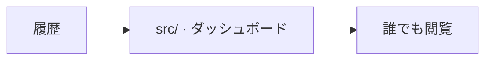

# web/

[English](README.md) · [技術](../tech-jp.md) · [セットアップ](../setup-jp.md) · [開く](https://beatavue.web.app)

心拍数・HRVの履歴を公開。

[ソース](src/)

ダッシュボードは英語と日本語に対応しています。初回はブラウザーの言語に合わせて表示し、ヘッダーで選んだ言語を記憶します。
